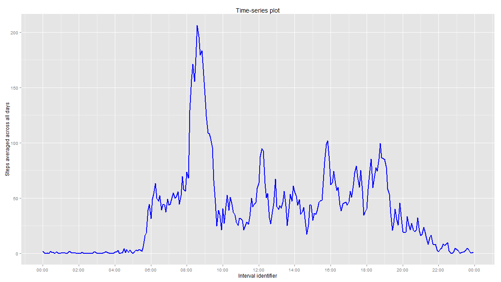

# Reproducible Research: Peer Assessment 1

## The Data

This assignment deals with the analysis of a  personal activity monitoring dataset that has in it, the number of steps walked by an individual collected once every 5 minutes, for a period of 61 days, from 1st October to 30th November, 2012. The missing values are labelled as NAs.  The "interval" column lists the 288 5-minute intervals of every day, starting from 0 through 55, then 100 through 155, 200 through 255 and so on until 2300 through 2355. The "steps" recorded against each interval identifier are the number of steps during the five-minute interval starting from that identifier. For example, the 0 under the "interval" column of the very first observation means that the steps recorded are the steps during 00:00 to 00:05 on 1st October. 

## Analysis

Before beginning the analysis, the various packages used in the analysis are loaded.


```r
library(dplyr)
library(ggplot2)
library(scales)
```

## Loading and preprocessing the data

### Loading

For loading the data, the .zip file containing the required .csv file is unzipped into the working directory. Then it is read with `read.csv()` as shown below.


```r
unzip("activity.zip")
activitydata <- read.csv("activity.csv")
```

### Pre-processing

1. The data frame is converted to a data frame compatible with "dplyr" package operations by using `tbl_df()` function. 
2. The interval column is converted to "HH : MM" (Hours : Minutes) character format by making use of `filter()`, `mutate()`, `arrange()`, `bind_rows()` etc. and `as.POSIXct()` function is applied to the `paste()`d string of "date" and "interval" to create a new new column called "date_time" by also using the `mutate()` function. 
3. A new data frame called "activitydata_tbldf_dummy" is created and a column called "interval_dummy" is generated in it by applying `as.POSIXct()` function just to the interval column. This data frame is to be used for question 2, "What is the average daily activity pattern?"  of the analysis.   
(Reason for step 3: It can be seen that the application of a string of "HH : MM" format to `as.POSIXct()` assumes today's date and the result produced consists of the timestamp in its entirety - with today's date and the time input! This useful albeit incorrect treatment is intended to plot the time-series of part 2 of this analysis with time-stamps on its x-axis, rather than strings. The problem of the appearance of today's date in the plot is solved by making use of `scale_x_datetime()` function from "ggplot2"" with the argument `labels = date_format("%H:%M")`, where `date_format()` itself is from "scales" package.)


```r
activitydata_tbldf <- tbl_df(activitydata)

interm1 <- filter(activitydata_tbldf, interval < 10)
interm1 <- mutate(interm1, interval = paste("00:0",interval, sep = ""))

interm2 <- filter(activitydata_tbldf, interval >= 10, interval <= 55)
interm2 <- mutate(interm2, interval = paste("00:",interval, sep = ""))

interm3 <- filter(activitydata_tbldf, interval >= 100, interval <= 955)
splst <- strsplit(as.character(interm3$interval),"")
interdf1 <- as.data.frame(splst)
interdf1 <- t(interdf1)
row.names(interdf1) <- 1 : nrow(interdf1)
interm3 <- mutate(interm3, interval = paste("0",interdf1[,1],":",interdf1[,2], interdf1[,3],sep = ""))

interm4 <- filter(activitydata_tbldf, interval > 955, interval <= 2355)
splst2 <- strsplit(as.character(interm4$interval),"")
interdf2 <- as.data.frame(splst2)
interdf2 <- t(interdf2)
row.names(interdf2) <- 1 : nrow(interdf2)
interm4 <- mutate(interm4, interval = paste(interdf2[,1], interdf2[,2], ":", interdf2[,3], interdf2[,4], sep = ""))

activitydata_tbldf <- bind_rows(interm1, interm2, interm3, interm4)
activitydata_tbldf <- arrange(activitydata_tbldf, date)
activitydata_tbldf <- mutate(activitydata_tbldf, date_time = paste(date, " ", interval, sep = ""))
activitydata_tbldf <- mutate(activitydata_tbldf, date_time = as.POSIXct(date_time, format = "%Y-%m-%d %H:%M"))

activitydata_tbldf_dummy <- mutate(activitydata_tbldf, interval_dummy = as.POSIXct(interval, format = "%H : %M", tz = "GMT"))
```

## What is mean total number of steps taken per day?

### Part 1: Calculation of total number of steps per day 

This is done as follows:  
1. Group the filtered data frame (data frame after removing NA values) by the value of the "date" column using the `group_by()` function.  
2. Calculate the sum of the steps for each group of the grouped data while ignoring the NA values, using the `summarise()` function.  


```r
by_date <- group_by(filter(activitydata_tbldf,!is.na(steps)),date)
total_steps_df <- summarise(by_date,steps_tot = sum(steps,na.rm = TRUE))
total_steps_df
```

```
## Source: local data frame [53 x 2]
## 
##          date steps_tot
##        (fctr)     (int)
## 1  2012-10-02       126
## 2  2012-10-03     11352
## 3  2012-10-04     12116
## 4  2012-10-05     13294
## 5  2012-10-06     15420
## 6  2012-10-07     11015
## 7  2012-10-09     12811
## 8  2012-10-10      9900
## 9  2012-10-11     10304
## 10 2012-10-12     17382
## ..        ...       ...
```

```r
total_steps <- select(total_steps_df,steps_tot)
```

### Part 2: Plotting the histogram of the total number of steps per day

The histogram of the total steps per day is plotted using `ggplot()` function as below.


```r
g <- ggplot(data = total_steps, aes(total_steps$steps_tot))
g + geom_histogram(col = "white",fill = "blue") + labs(title = "Histogram for total steps per day") + labs(x = "Total steps per day", y = "Count of days")
```

 

### Part 3: Calculating the mean and median of the total steps taken per day (ignoring NA values)


```r
mean_steps_date <- mean(total_steps$steps_tot)
mean_steps_date
```

```
## [1] 10766.19
```

```r
median_steps_date <- median(total_steps$steps_tot)
median_steps_date
```

```
## [1] 10765
```

Thus the `mean` and `median` of the total steps per day are **1.0766189 &times; 10<sup>4</sup>** and **10765** respectively.

## What is the average daily activity pattern?

### Part 1: Plotting time-series plot of 5-minute intervals and the mean steps

This is done as follows:  
1. Group the data by the interval identifier.  
2. Find the mean of the steps for each identifier across all the days.  
3. Plot with interval on x-axis and the means on the y-axis. (The breaks are shown at intervals of 2 hours.)


```r
by_interval <- group_by(activitydata_tbldf_dummy,interval_dummy)

mean_steps_2 <- summarise(by_interval, steps_mean_interval = mean(steps,na.rm = TRUE))
mean_steps_interval <- select(mean_steps_2, steps_mean_interval)

h <- ggplot(data = mean_steps_2, aes(x = mean_steps_2$interval_dummy, y = mean_steps_2$steps_mean_interval))
h + geom_line(col = "blue", size = 0.75) + labs(title = "Time-series plot") + labs(x = "Interval identifier", y = "Steps averaged across all days") + scale_x_datetime(labels = date_format("%H:%M"), breaks = date_breaks("2 hour"))
```

 


### Part 2: Finding the interval with the maximum mean steps

The time interval that is required is obtained by sorting the mean steps across all days in descending order and taking the first element in the interval column.


```r
ordered_mean_steps_2 <- arrange(mean_steps_2,desc(steps_mean_interval))

max_steps_interval <- ordered_mean_steps_2[1,1]
max_steps_interval <- format(max_steps_interval, format = "%H:%M")

max_steps <- as.numeric(ordered_mean_steps_2[1,2])

max_steps_interval <- mutate(max_steps_interval,Interval_maxsteps = interval_dummy, Maximum_mean_steps = max_steps)
max_steps_interval <- select(max_steps_interval, Interval_maxsteps, Maximum_mean_steps)
max_steps_interval
```

```
##   Interval_maxsteps Maximum_mean_steps
## 1             08:35           206.1698
```


It can be observed that the interval identifier corresponding to the maximum number of steps averaged across all days is **08:35**, which means that the maximum activity on average occurred between **08:35** and **08:40** with the maximum average steps being **206.1698113**

## Imputing missing values

### Part 1: Calculating the total number of missing values in the dataset


```r
part_df_na <- filter(activitydata_tbldf, is.na(steps))
part_df_no_na <- filter(activitydata_tbldf,!is.na(steps))
NA_number <- nrow(part_df_na)
NA_number
```

```
## [1] 2304
```

Thus it can be seen that there are **2304** missing values in the data set.

### Part 2: The strategy for filling in missing values

For this part, it is chosen that the mean for the corresponding 5-minute period is used to fill in missing values.

### Part 3: Creating new dataset with missing values filled in


```r
mean_steps_3 <- mutate(mean_steps_2, interval = activitydata_tbldf$interval[1:288])
part_df_na_filled <- group_by(part_df_na, interval)
part_df_na_filled$steps <- mean_steps_3$steps_mean_interval

df_na_filled <- bind_rows(part_df_no_na, part_df_na_filled)
df_na_filled <- arrange(df_na_filled, date_time)
```

### Part 4: Answering question 1 for imputed data set 

#### Calculating total steps per day for imputed data


```r
by_date_na_filled <- group_by(df_na_filled,date)
total_steps_df_na_filled <- summarise(by_date_na_filled,steps_tot = sum(steps))
total_steps_df_na_filled
```

```
## Source: local data frame [61 x 2]
## 
##          date steps_tot
##        (fctr)     (dbl)
## 1  2012-10-01  10766.19
## 2  2012-10-02    126.00
## 3  2012-10-03  11352.00
## 4  2012-10-04  12116.00
## 5  2012-10-05  13294.00
## 6  2012-10-06  15420.00
## 7  2012-10-07  11015.00
## 8  2012-10-08  10766.19
## 9  2012-10-09  12811.00
## 10 2012-10-10   9900.00
## ..        ...       ...
```

```r
total_steps_na_filled <- select(total_steps_df_na_filled,steps_tot)
```

#### Plotting histogram of total steps per day for imputed data


```r
range <- max(total_steps_na_filled$steps_tot) - min(total_steps_na_filled$steps_tot)
i <- ggplot(data = total_steps_na_filled, aes(total_steps_na_filled$steps_tot))
i + geom_histogram(binwidth = range/30 ,col = "white",fill = "blue") + labs(title = "Histogram for total steps per day for new dataset") + labs(x = "Total steps per day", y = "Count of days")
```

 

#### Calculating mean and median of total steps per day for imputed data


```r
mean_steps_date_na_filled <- mean(total_steps_na_filled$steps_tot)
mean_steps_date_na_filled
```

```
## [1] 10766.19
```

```r
median_steps_date_na_filled <- median(total_steps_na_filled$steps_tot)
median_steps_date_na_filled
```

```
## [1] 10766.19
```

The `mean` and `median` values for the imputed data set are **1.0766189 &times; 10<sup>4</sup>** and **1.0766189 &times; 10<sup>4</sup>** respectively. 

#### Impact of imputing

First, it can be observed that there is a difference of **0** in the means and **1.1886792** in the medians of imputed data set and original data set.

Theoretically, since all the missing values are replaced by the means for the 5-minute interval, each missing day newly gets the same total steps, which is identical to the mean calculated ignoring the days without measurement, i.e. 1.0766189 &times; 10<sup>4</sup>. Thus this newly adds a number of 1.0766189 &times; 10<sup>4</sup>s to the grandsum, taking whose mean yields an unchanged result.  This does not apply to the median, thus the slight difference in medians. But it can be observed that, since some significant number of means are added to the "total number of steps per day" data and mean is located near the centre, it is likely that the new median is equal to the new/old mean itself.   

## Are there differences in activity patterns between weekdays and weekends?

### Part 1: Creating factor variable with levels "Weekday" and "Weekend"

For this,  
1. The imputed data set is used. 
2. An "interval_dummy" column is created as discussed above (step 3 under "Preprocessing" and question 2 part 1)to plot timestamps on the x-axis instead of strings. 
3. `weekdays()` function is used to create the "day" column from the "datetime" variable of the dataset having actual dates and times of measurement. 
4. A new column called "week_day_position" is added to the data frame with two levels- "Weekday" if the day is "Mon" through "Fri", and "Weekend" if the day is "Sat" or "Sun".


```r
weekpos_df <- mutate(df_na_filled, interval_dummy = as.POSIXct(interval, format = "%H : %M", tz = "GMT"), day = weekdays(date_time, abbreviate = TRUE))

weekday_df <- filter(weekpos_df, day == "Mon" | day == "Tue" | day == "Wed" | day == "Thu" | day == "Fri")
weekday_df <- mutate(weekday_df, week_day_position = "Weekday")

weekend_df <- filter(weekpos_df, day == "Sat" | day == "Sun")
weekend_df <- mutate(weekend_df, week_day_position = "Weekend")

weekpos_df <- bind_rows(weekday_df, weekend_df)
weekpos_df <- select(weekpos_df, -day)
```

### Part 2: Plotting time-series plot faceted by "Weekday" and "Weekend" 

This is done as follows:  
1. Group the data by "week_day_position" and "interval_dummy".  
2. Find the mean of the steps for each identifier across all the weekdays and weekends.   
3. Plot with interval on x-axis and the means on the y-axis with two facets; one for "Weekday", another for "Weekend". (The breaks are shown at intervals of 2 hours.)   


```r
by_interval_weekpos <- group_by(weekpos_df, week_day_position, interval_dummy)
total_steps_weekpos <- summarise(by_interval_weekpos, steps_day_weekpos = mean(steps))

j <- ggplot(data = total_steps_weekpos, aes(x = interval_dummy, y = steps_day_weekpos))
j + geom_line(color = "blue", size = 0.75) + facet_grid(week_day_position~.) + scale_x_datetime(labels = date_format("%H:%M"), breaks = date_breaks("2 hour")) + labs(title = "Time-series plot") + labs(x = "Interval identifier", y = "Steps averaged across all days")
```

 

#### Differences between activity pattern for weekdays and weekends

From the time-series plot, it can be observed that there are significant differences, one of which is that the average steps for weekdays are very high near morning hours, i.e. 6:00-10:00, whereas in weekends, they do not become very high until 8:00 after which they remain moderately high until 22:00. In the case of weekdays, however, the average steps start to decrease at 20:00.  Also, the peak mean steps is higher for weekdays than for weekends.
